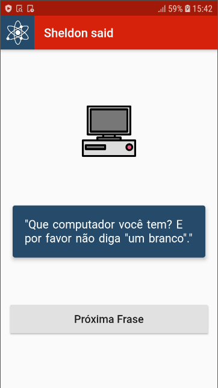
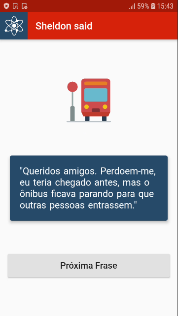
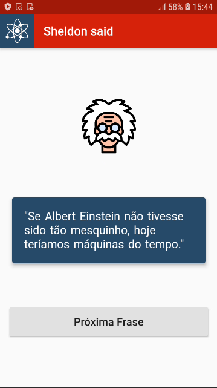

# Sheldon Said :speech_balloon:

Aplicação feita em Flutter para implementar meus estudos.

## Screenshots

<iframe src="https://giphy.com/embed/iGX5jFfDX4Ka03fTAb" width="270" height="480" frameBorder="0" class="giphy-embed" allowFullScreen></iframe>
<a href="https://giphy.com/gifs/sheldonsaid-iGX5jFfDX4Ka03fTAb">via GIPHY</a>

## Getting Started

This project is a starting point for a Flutter application.

A few resources to get you started if this is your first Flutter project:

- [Lab: Write your first Flutter app](https://flutter.dev/docs/get-started/codelab)
- [Cookbook: Useful Flutter samples](https://flutter.dev/docs/cookbook)

For help getting started with Flutter, view our
[online documentation](https://flutter.dev/docs), which offers tutorials,
samples, guidance on mobile development, and a full API reference.
